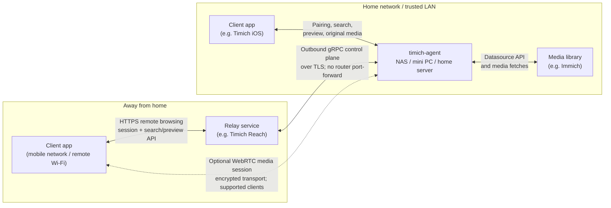

# timich-agent

`timich-agent` runs on the computer, NAS, or home server that can reach your
Immich library. It acts as a private gateway for client apps, such as the
Timich iOS app: devices can pair on your trusted LAN, browse and fetch media
through a local API, and optionally keep browsing away from home through a relay
service such as Timich Reach, without exposing Immich directly to the internet.

Most users should install the latest release bundle. Build from source only if
you are developing, testing, or packaging the agent yourself.

If you want MCP clients such as Codex to search and preview media through a
paired Agent, run [`timich-mcp`](https://github.com/rsahara/timich-mcp) on the
machine where the MCP client runs.

## Features

- Pair trusted devices with one-time codes, scoped access tokens, and refresh
  tokens, so client apps do not need direct access to your Immich credentials.
- Browse the library at home or away. On the trusted LAN, client apps talk to
  the agent directly; away from home, they can use a relay service such as
  Timich Reach while Immich stays behind your home network.
- Keep the remote-browsing path outbound-only with a gRPC control-plane stream
  from the agent to Timich Reach, so home routers do not need inbound
  port-forward rules.
- Keep browsing fast with separate asset search, preview, detail-preview, and
  original media paths. Clients can render a responsive gallery first, then
  fetch heavier media only when the user needs it.
- Use WebRTC media sessions for supported clients. When the network path allows
  it, a client can negotiate peer-to-peer media transfer with the machine
  running the agent, such as your NAS.
- Manage the operational pieces locally: agent identity, paired-device state,
  session signing, relay credentials, admin token, and Immich datasource config
  all live on the agent host.

At a high level, `timich-agent` sits between client apps and a home media
library:



## Install From a Release Bundle

Release archives are named by version, OS, and CPU architecture. For a Linux
NAS, mini PC, or home server, choose the archive that matches your CPU.

1. Open the latest release:
   <https://github.com/rsahara/timich-agent/releases/latest>
2. Download the archive for your host, for example:
   - `timich-agent_VERSION_linux_amd64.tar.gz`
   - `timich-agent_VERSION_linux_arm64.tar.gz`
3. Download the matching `.sha256` file and verify the archive:

```bash
sha256sum -c timich-agent_VERSION_linux_ARCH.tar.gz.sha256
```

4. Extract the bundle:

```bash
mkdir -p timich-agent
tar -xzf timich-agent_VERSION_linux_ARCH.tar.gz -C timich-agent --strip-components=1
cd timich-agent
./timich-agent version
```

The bundle includes the `timich-agent` binary, Docker Compose files,
`.env.example`, build metadata, and a bundle-local README.

## First Run

Docker Compose is the recommended way to run the release bundle:

```bash
cp .env.example .env
# Optional: edit .env to rename the agent, change host ports, or opt out of Remote Browsing.
docker compose -f compose.yaml up -d --build
docker compose -f compose.yaml logs -f
```

On first start, the container creates `.local/agent.json` and
`.local/state/agent-state.json` next to the bundle. Keep `.local` when updating
or moving the installation because it contains the agent settings, identity,
admin token, and paired-device registry.

Open the Admin UI from the agent host or a trusted LAN device:

```text
http://AGENT_LAN_HOST:8081/
```

Use `http://127.0.0.1:8081/` when you are on the agent host itself for setup
and manual code entry. QR pairing needs a phone-reachable media API URL, so
open the Admin UI with the agent LAN host/IP or set
`TIMICH_AGENT_ADVERTISED_MEDIA_BASE_URL`. When QR/link pairing cannot be
prepared from the Admin UI URL, the Admin UI still creates a manual pairing
code and shows a warning beside the missing QR code.

First-run setup in the Admin UI:

1. Create an admin token with at least 16 characters.
2. Configure the primary Immich datasource with the Immich server URL and an
   Immich API key.
3. Create a pairing code and enter it in the Timich iOS app.
4. Confirm the app can load the gallery on the trusted LAN.
5. Optional: run Remote Browsing checks if you want Timich Reach access away
   from home.

The admin API on port `8081` and media API on port `8082` are plain HTTP and
are intended only for a trusted local network or host-local access. Do not
publish them to the internet, add router port-forward rules for them, or use
them on guest Wi-Fi or shared untrusted networks. Timich Reach is the remote
access path.

## Running Modes

### Docker Compose

Compose runs use `restart: unless-stopped`, publish the admin and media APIs on
host ports `8081` and `8082`, and mount `.local` into the container.

Common `.env` settings:

```bash
TIMICH_AGENT_NAME=Timich Agent
TIMICH_AGENT_DEVICE_LIMIT=32
TIMICH_AGENT_APP_LINK_BASE_URL=https://link.timich.runo.jp
TIMICH_AGENT_ADVERTISED_MEDIA_BASE_URL=http://AGENT_LAN_HOST:8082
TIMICH_AGENT_REMOTE_BROWSING_ENABLED=true
TIMICH_AGENT_ADMIN_PORT=8081
TIMICH_AGENT_MEDIA_PORT=8082
```

For Docker Compose installs, keep the agent's in-container listen addresses at
their defaults and restrict exposure with host-side port publishing. In a
release-bundle or source `.env`, use `TIMICH_AGENT_ADMIN_PORT=127.0.0.1:8081`
and `TIMICH_AGENT_MEDIA_PORT=127.0.0.1:8082` to publish both APIs only on the
agent host. In a custom Compose file, the equivalent `ports` entries are
`127.0.0.1:8081:8081` and `127.0.0.1:8082:8082`.

Set `TIMICH_AGENT_ADVERTISED_MEDIA_BASE_URL` when QR/link pairing should be
available from a host-local Admin UI URL such as `http://127.0.0.1:8081/`, or
when a reverse proxy means the Admin UI host is not the same phone-reachable
host as the media API. Use the URL the iPhone or iPad can reach on the trusted
LAN, for example `http://192.168.1.20:8082`. Manual pairing-code creation does
not require this setting.

Set `TIMICH_AGENT_REMOTE_BROWSING_ENABLED=false` before starting compose if you
want the agent to stay local-only.

Stop and start the service with:

```bash
docker compose -f compose.yaml down
docker compose -f compose.yaml up -d --build
```

### Direct Binary

Direct binary runs are useful for manual testing or custom service managers:

```bash
mkdir -p .local
./timich-agent init -config .local/agent.json -data-dir .local/state
./timich-agent serve -config .local/agent.json
```

The direct binary defaults to `.local/agent.json` when no config path is passed.
You can also set `TIMICH_AGENT_CONFIG_PATH`, `TIMICH_AGENT_DATA_DIR`, and
`TIMICH_AGENT_UPDATE_MANIFEST_URL` before starting the process. Developers who
need Debug-build Universal Links can set `TIMICH_AGENT_APP_LINK_BASE_URL` to
`https://link.dev.timich.runo.jp`.

## Updating the Agent

Release bundles publish an `agent-update-manifest.json` asset next to the
downloadable archives and checksums. The Admin UI uses the authenticated
`/v1/update-check` endpoint to show whether a newer stable agent release is
available.

For Docker Compose installs:

```bash
# From the existing installation directory.
docker compose -f compose.yaml down

# Download the new archive, then extract it over the existing bundle files.
# Keep .local. It contains settings, the admin token, and paired devices.
tar -xzf ../timich-agent_NEWVERSION_linux_ARCH.tar.gz --strip-components=1

docker compose -f compose.yaml up -d --build
docker compose -f compose.yaml logs -f
```

After the service is back online, open the Admin UI and confirm the displayed
version. If you run the binary under systemd, launchd, or another supervisor,
stop the service, replace the `timich-agent` binary, keep the same config/state
directory, and start the service again.

## Admin UI and APIs

The admin surface serves a small web management UI at
`http://AGENT_LAN_HOST:8081/`. The admin API requires the admin bearer token for
every route except `/healthz`, `/readyz`, `/version`, and the first-run
admin-token setup route.

The Admin UI currently covers:

- agent status and remote browsing readiness
- first-run admin-token setup
- agent update checks
- primary Immich datasource editing
- pairing-code creation
- paired-device listing and revoke
- remote browsing checks
- agent restart

Datasource editing is intentionally limited to the first datasource because the
current media proxy uses only the first configured datasource. Static demo
datasources are configured through the JSON config file instead of the current
web form.

The restart action gracefully stops the running process. It is useful when the
agent is supervised by Docker Compose, a NAS service, launchd, or systemd. When
running in the foreground, the process exits and must be started again manually.

Admin API:

- `GET http://AGENT_LAN_HOST:8081/`
- `GET http://AGENT_LAN_HOST:8081/healthz`
- `GET http://AGENT_LAN_HOST:8081/readyz`
- `GET http://AGENT_LAN_HOST:8081/version`
- `GET http://AGENT_LAN_HOST:8081/status`
- `GET http://AGENT_LAN_HOST:8081/config`
- `POST http://AGENT_LAN_HOST:8081/setup-admin-token`
- `GET http://AGENT_LAN_HOST:8081/v1/datasource/primary`
- `PUT http://AGENT_LAN_HOST:8081/v1/datasource/primary`
- `POST http://AGENT_LAN_HOST:8081/v1/pairing-sessions`
- `POST http://AGENT_LAN_HOST:8081/v1/compatibility-check`
- `GET http://AGENT_LAN_HOST:8081/v1/update-check`
- `POST http://AGENT_LAN_HOST:8081/v1/restart`
- `GET http://AGENT_LAN_HOST:8081/v1/devices`
- `DELETE http://AGENT_LAN_HOST:8081/v1/devices/{deviceID}`

Media API:

- `GET http://AGENT_LAN_HOST:8082/healthz`
- `GET http://AGENT_LAN_HOST:8082/version`
- `GET http://AGENT_LAN_HOST:8082/v1/info`
- `POST http://AGENT_LAN_HOST:8082/v1/pairing/redeem`
- `POST http://AGENT_LAN_HOST:8082/v1/session/refresh`
- `POST http://AGENT_LAN_HOST:8082/v1/assets/search`
- `GET http://AGENT_LAN_HOST:8082/v1/assets/search/capabilities`
- `GET http://AGENT_LAN_HOST:8082/v1/assets/{assetID}/preview`
- `GET http://AGENT_LAN_HOST:8082/v1/assets/{assetID}/detail_preview`
- `GET http://AGENT_LAN_HOST:8082/v1/assets/{assetID}/original`

When you call the admin API from the agent host, export the saved admin token:

```bash
export TIMICH_AGENT_ADMIN_TOKEN="$(jq -r .adminToken .local/state/agent-state.json)"
curl -s http://127.0.0.1:8081/status \
  -H "Authorization: Bearer $TIMICH_AGENT_ADMIN_TOKEN"
```

## Communication Security Notes

- The local admin and media APIs are plain HTTP by default. Treat them as
  trusted-LAN or host-local surfaces only. For Docker Compose, keep the
  in-container listen addresses at their defaults and restrict the published
  host ports to `127.0.0.1`. For direct binary runs, bind both
  `adminListenAddress` and `mediaListenAddress` to loopback addresses. Use the
  local browser or SSH tunnels as needed.
- Timich Reach does not require inbound access to your home network. The agent
  opens the remote-browsing control plane outbound using gRPC over HTTP/2 with
  publicly trusted TLS, then signs short-lived control-plane bearer tokens with
  the relay private key stored on the agent host.
- Client app requests still use Timich session authorization. Local LAN
  requests use access tokens scoped to the `timich-agent` media API, while
  remote-browsing requests are authorized through the Reach session path.
- Optional WebRTC media sessions are for supported clients and network paths.
  They use WebRTC's encrypted transport, but they do not replace pairing,
  session checks, or media-route authorization.
- Immich credentials stay on the agent host. Client apps and Timich Reach use
  Timich-issued sessions and relay credentials instead of receiving the Immich
  API key directly.

## Pairing Security Notes

- Pairing codes are one-time 128-bit random values encoded as 32 hex characters.
- The Admin API also returns a Timich app Universal Link and QR code for the
  active code when it can determine a phone-reachable media API URL. Treat that
  link like the code itself until it expires because it contains the one-time
  code and media API URL. The agent will not silently embed `localhost` or
  `127.0.0.1` in QR links; if a phone-reachable URL is unavailable, the API
  still returns the manual pairing code with a QR/link warning.
- The agent keeps only one active pairing session at a time; creating a new code
  replaces any earlier unredeemed code.
- After five failed redemption attempts against the active pairing session, the
  agent invalidates that session and requires the operator to create a fresh
  pairing code.
- Access tokens are short-lived, device-scoped, and audience-scoped for the
  local `timich-agent` media API.
- Refresh tokens are stored at rest as salted hashes in the paired-device
  registry instead of being persisted verbatim.
- Immich datasource API keys are stored in the local agent config file with
  owner-only file permissions. This is an accepted risk for the current
  Docker/package milestone because the agent does not yet have a separate local
  secret store. The admin UI and API only show whether a key is configured, not
  the key value.
- The session-signing key and relay private key remain plaintext in the local
  state file because the single-process agent must read them directly to mint
  app-session tokens and sign relay connection tokens, and does not yet have a
  separate local secret store.
- The relay private key is generated automatically by the agent. The agent
  registers only the matching public key with the Timich Reach server; users do
  not need to install client certificates or server-issued bootstrap secrets.
  Before first registration, unauthenticated LAN info does not expose the agent
  ID; setup and pairing still happen on a trusted LAN. The relay server
  rate-limits new first-write registrations by client address, and the agent
  retries registration if the server asks it to slow down.
- Config, identity state, and device-registry files are replaced with atomic
  temp-file writes so an interrupted write does not leave a truncated JSON file
  behind.

## Configuration Reference

A starter config created by `timich-agent init` looks like this. Add
`advertisedMediaBaseURL` when QR pairing needs an explicit phone-reachable
media API URL:

```json
{
  "agentName": "your-hostname",
  "adminListenAddress": "0.0.0.0:8081",
  "mediaListenAddress": "0.0.0.0:8082",
  "advertisedMediaBaseURL": "http://AGENT_LAN_HOST:8082",
  "dataDir": "state",
  "deviceLimit": 32,
  "appLinkBaseURL": "https://link.timich.runo.jp",
  "relayConnectionAddress": "https://control.timich.runo.jp:18090",
  "remoteBrowsing": {
    "enabled": false,
    "serverURL": "https://timich.runo.jp"
  },
  "datasources": []
}
```

For direct binary runs, set `adminListenAddress` to `127.0.0.1:8081` if you
want to opt out of LAN admin access and use only the local browser,
authenticated admin API, or SSH tunnel workflows. Set `mediaListenAddress` to
`127.0.0.1:8082` as well if the media API should also stay host-local; LAN
client apps need it to remain reachable on the trusted network. For Docker
Compose, restrict the host-side port publishing instead of changing these
in-container listen addresses to loopback.

`advertisedMediaBaseURL` is optional. Leave it empty when operators open the
Admin UI with the same LAN host/IP that app devices can use for the media API.
Set it to a phone-reachable media API URL when QR pairing starts from
`localhost`, a reverse proxy, or any host name that should not be embedded in
the Timich app Universal Link payload. If it is omitted in those cases, manual
pairing-code creation still works, but the Universal Link and QR code are
omitted from the pairing-session response.

The first datasource-backed local flow proxies the first configured Immich
datasource for asset search pages plus `preview`, `detail_preview`, and
`original` media delivery. A `static_demo` datasource can also serve a generated
sample bundle from local disk for repeatable local testing.

## Build From Source

From the directory containing this README and the agent Makefile:

```bash
make test
make build
make init
make run
make docker-build
make docker-run
make compose-up
```

Source builds use local development paths by default:

- config: `.local/agent.json`
- state: `.local/state/agent-state.json`
- admin API: `0.0.0.0:8081`
- media API: `0.0.0.0:8082`

Stop a compose run with:

```bash
make compose-down
```

## Developer Smoke Tests

Create a pairing code from the authenticated admin API:

```bash
curl -s -X POST http://127.0.0.1:8081/v1/pairing-sessions \
  -H "Authorization: Bearer $TIMICH_AGENT_ADMIN_TOKEN"
```

From a host-local Admin UI/API URL, the response may contain only
`pairingCode`, `expiresAt`, and `pairingLinkWarning`. Set
`TIMICH_AGENT_ADVERTISED_MEDIA_BASE_URL` or call the Admin API through the
agent LAN host/IP when the smoke test needs the Universal Link and QR fields.

Redeem that code from the LAN-facing media API:

```bash
curl -s -X POST http://127.0.0.1:8082/v1/pairing/redeem \
  -H 'Content-Type: application/json' \
  -d '{"pairingCode":"PAIRING_CODE","deviceName":"Test iPhone"}'
```

Use the returned `accessToken` against the first timeline search page:

```bash
curl -s -X POST http://127.0.0.1:8082/v1/assets/search \
  -H 'Authorization: Bearer ACCESS_TOKEN' \
  -H 'Content-Type: application/json' \
  -d '{"collection":{"kind":"timeline"},"page":{"index":0,"size":60}}'
```

Refresh the session with the returned `refreshToken`:

```bash
curl -s -X POST http://127.0.0.1:8082/v1/session/refresh \
  -H 'Content-Type: application/json' \
  -d '{"refreshToken":"REFRESH_TOKEN"}'
```

Remote browsing lets a Timich app browse through the Timich relay when the
device is away from the home network. The local admin API can run a lightweight
readiness check for datasource access and the relay path:

```bash
curl -s -X POST http://127.0.0.1:8081/v1/compatibility-check \
  -H "Authorization: Bearer $TIMICH_AGENT_ADMIN_TOKEN" | jq
```

The check can return `ok`, `warning`, or `failed`. A `warning` is expected
during first-run setup before a device is paired and the agent has registered
its relay credential.

The current check covers:

- remote browsing and relay connection config presence
- relay signing-key state and registration status
- datasource metadata reachability
- relay server `/version` reachability
- gRPC control-plane hello/ack round trip once relay credentials are registered

Example static demo config:

```json
{
  "agentName": "Timich Demo Agent",
  "adminListenAddress": "127.0.0.1:8081",
  "mediaListenAddress": "127.0.0.1:8082",
  "dataDir": "state",
  "remoteBrowsing": {
    "enabled": true,
    "serverURL": "https://timich.runo.jp"
  },
  "datasources": [
    {
      "id": "static-demo",
      "kind": "static_demo",
      "url": "/opt/timich/static-demo-bundle",
      "name": "Static Demo",
      "enabled": true
    }
  ]
}
```

The static demo bundle is generated from original photos/videos and contains a
`manifest.json` plus per-asset preview, detail-preview, and original files. From
the source tree, generate a 120-item bundle with:

```bash
go run ./cmd/timich-static-demo-bundle \
  --input /path/to/original-samples \
  --output /path/to/static-demo-bundle \
  --count 120
```

The generator places image assets before video assets so a first-page Remote
Browsing activation can show a full page of photos while the second page still
includes video fixtures. Generated image originals are capped to a reasonable
test size and are re-encoded as JPEG; video originals are copied through with
generated poster previews.

## Contributing and Security

See [CONTRIBUTING.md](CONTRIBUTING.md) for local setup and pull request
guidance. Please report vulnerabilities through the private process described
in [SECURITY.md](SECURITY.md).

## License

Timich Agent is released under the [MIT License](LICENSE).
