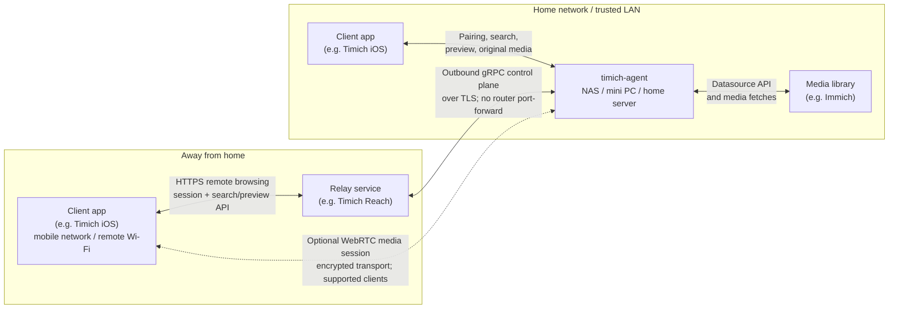

# timich-agent

`timich-agent` runs on the computer, NAS, or home server that can reach your
Immich library. It acts as a private gateway for client apps, such as the
Timich iOS app: devices can pair on your trusted LAN, browse and fetch media
through a local API, and optionally keep browsing away from home through a relay
service such as Timich Reach, without exposing Immich directly to the internet.

Most users should install the latest release bundle. Build from source only if
you are developing, testing, or packaging the agent yourself.

## Why Timich Agent

Timich Agent grew from wanting a photo system that keeps the library at home,
makes the transition between local and remote browsing feel seamless, and can
run continuously on modest hardware such as a NAS. Remote access should not
require exposing the photo library directly or operating a server-class
machine at home.

NAS-friendly operation is a lasting design constraint, not a one-time release
target. Normal browsing and connection handling should remain lightweight and
predictable. Heavier optional work, such as thumbnail generation and semantic
indexing, should stay observable, configurable, and pausable so it does not
take over the host. Future Agent features are expected to preserve that
separation.

If you want MCP clients such as Codex to search and preview media through a
paired Agent, run [`timich-mcp`](https://github.com/rsahara/timich-mcp) on the
machine where the MCP client runs.

## Features

- Pair trusted devices with one-time codes, scoped access tokens, and refresh
  tokens, so client apps do not need direct access to your Immich credentials.
- Browse the library at home or away. On the trusted LAN, client apps talk to
  the agent directly; away from home, they can use a relay service such as
  Timich Reach while Immich stays behind your home network.
- Keep the remote-browsing path outbound-only with a gRPC control-plane stream
  from the agent to Timich Reach, so home routers do not need inbound
  port-forward rules.
- Keep browsing fast with separate asset search, preview, detail-preview, and
  original media paths. Clients can render a responsive gallery first, then
  fetch heavier media only when the user needs it.
- Use WebRTC media sessions for supported clients. When the network path allows
  it, a client can negotiate peer-to-peer media transfer with the machine
  running the agent, such as your NAS.
- Manage the operational pieces locally: agent identity, paired-device state,
  session signing, relay credentials, admin token, and Immich datasource config
  all live on the agent host.

At a high level, `timich-agent` sits between client apps and a home media
library:



## Install From a Release Bundle

Release archives are named by version, OS, and CPU architecture. The protected
0.4 release publisher currently produces and verifies the Linux amd64 bundle.

1. Open the latest release:
   <https://github.com/rsahara/timich-agent/releases/latest>
2. Download `timich-agent_VERSION_linux_amd64.tar.gz`.
3. Download the matching `.sha256` file and verify the archive:

```bash
sha256sum -c timich-agent_VERSION_linux_ARCH.tar.gz.sha256
```

4. Extract the bundle:

```bash
mkdir -p timich-agent
tar -xzf timich-agent_VERSION_linux_ARCH.tar.gz -C timich-agent --strip-components=1
cd timich-agent
./timich-agent version
./timich-semantic-helper version
```

The bundle includes the `timich-agent` binary, `timich-semantic-helper`,
`timich-media-helper`, Docker Compose files, `.env.example`, build metadata, and
a bundle-local README.
When platform media runtimes are included, direct native runs auto-detect the
bundle-local `media-runtime/libvips/bin/vips` and
`media-runtime/ffmpeg/bin/ffmpeg` executables for local filesystem thumbnails.
Docker images built from the bundle use a glibc-based Debian runtime and install
`ffmpeg` and `libvips-tools` for local filesystem thumbnail generation,
including MP4/MOV poster frames and HEIC/HEIF inputs. The glibc runtime also
allows the Linux semantic runtime pack published with the release to execute
inside the container.

## First Run

Docker Compose is the recommended way to run the release bundle:

```bash
cp .env.example .env
# Optional: edit .env to rename the agent, change host ports, or opt out of Remote Browsing.
cp compose.immich-network.example.yaml compose.immich-network.yaml
# Optional: edit compose.immich-network.yaml if your Immich Compose network is not immich_default.
docker compose -f compose.yaml -f compose.immich-network.yaml up -d --build
docker compose -f compose.yaml -f compose.immich-network.yaml logs -f
```

On first start, the container creates `.local/agent.json` and
`.local/state/agent-state.json` next to the bundle. Keep `.local` when updating
or moving the installation because it contains the agent settings, identity,
admin token, and paired-device registry.

To use a host or NAS photo directory as a Local datasource, add the bundled
read-only mount override before starting:

```bash
cp compose.local-media.example.yaml compose.local-media.yaml
# Add this to .env and use the real host path:
TIMICH_AGENT_LOCAL_MEDIA_HOST_PATH=/share/Photos

docker compose -f compose.yaml -f compose.immich-network.yaml -f compose.local-media.yaml up -d --build
```

The override exposes the host directory as `/media/photos` inside the
container. After the first start creates `.local/agent.json`, stop the Agent,
add this root, and restart with the same Compose file list:

```json
{
  "localMediaRoots": [
    {
      "key": "nas-photos",
      "path": "/media/photos"
    }
  ]
}
```

The Admin UI intentionally enables Local datasource creation only after the
container-visible path is registered in `localMediaRoots` and the Agent has
restarted. Keep `compose.local-media.yaml` in every later Compose command. Omit
`compose.immich-network.yaml` when Immich is not running in a separate Docker
Compose network.

Open the Admin UI from the agent host or a trusted LAN device:

```text
http://AGENT_LAN_HOST:8081/
```

Use `http://127.0.0.1:8081/` when you are on the agent host itself for setup
and manual code entry. Manual pairing codes remain available for reviewer
access, command-line clients, and troubleshooting. Clients that support Nearby
Link can instead show a short Link Code on the device and wait for a local admin
approval through the authenticated Admin API.

First-run setup in the Admin UI:

1. Create an admin token with at least 16 characters.
2. Configure the primary Immich datasource with the Immich server URL and an
   Immich API key. The default `Immich (Passthrough)` type relays Immich's
   gallery and search results directly and must remain the only datasource.
   Choose `Immich (Indexed)` before adding local or additional datasources. For
   the common Docker Compose layout where this Agent joins Immich's
   `immich_default` network, use `http://immich_server:2283`.
3. Indexed modes only: run media discovery, then install and activate a model
   from Semantic Models. Background vector indexing continues through
   Datasource Tasks. Immich Passthrough uses Immich's existing search index and
   does not require these local indexing steps.
4. Pair an app device. Use Nearby Link when the app supports it, or create a
   manual pairing code and enter it in the Timich iOS app.
5. Confirm the app can load the gallery on the trusted LAN.
6. Optional: run Remote Browsing checks if you want Timich Reach access away
   from home.

The admin API on port `8081` and media API on port `8082` are plain HTTP and
are intended only for a trusted local network or host-local access. Do not
publish them to the internet, add router port-forward rules for them, or use
them on guest Wi-Fi or shared untrusted networks. Timich Reach is the remote
access path.

## Running Modes

### Docker Compose

Compose runs use `restart: unless-stopped`, publish the admin and media APIs on
host ports `8081` and `8082`, and mount `.local` into the container.
`compose.local-media.example.yaml` is the opt-in read-only host-media mount; the
base Compose file never exposes an arbitrary host directory.

Common `.env` settings:

```bash
TIMICH_AGENT_NAME=Timich Agent
TIMICH_AGENT_DEVICE_LIMIT=32
TIMICH_AGENT_APP_LINK_BASE_URL=https://link.timich.runo.jp
TIMICH_AGENT_REMOTE_BROWSING_ENABLED=true
# Optional IANA timezone for agent-local dates; empty uses container/process time.
# TIMICH_AGENT_TIMEZONE=Asia/Tokyo
TIMICH_AGENT_ADMIN_PORT=8081
TIMICH_AGENT_MEDIA_PORT=8082
# TIMICH_AGENT_MEDIA_PUBLISHED_ADDR=10.0.111.128:18082
# Host path used only after copying compose.local-media.example.yaml.
# TIMICH_AGENT_LOCAL_MEDIA_HOST_PATH=/share/Photos
# Optional shared budget for heavy background work. Empty or omitted uses max(1, logical CPU count / 2); 0 pauses heavy work.
# TIMICH_AGENT_HEAVY_TASK_WORKERS=1
# Optional alternate update/model registries for testing or mirroring.
# TIMICH_AGENT_UPDATE_MANIFEST_URL=https://example.invalid/agent-update-manifest.json
# TIMICH_AGENT_SEMANTIC_MODEL_MANIFEST_URL=https://example.invalid/semantic-models.json
# Optional Rust media helper path for native image/video runtime health.
# Native bundles auto-detect timich-media-helper next to timich-agent when included.
# TIMICH_AGENT_MEDIA_HELPER_PATH=/usr/local/bin/timich-media-helper
# Optional libvips executable path override for local filesystem thumbnails.
# Native bundles auto-detect media-runtime/libvips/bin/vips when included.
# Docker images find /usr/bin/vips on PATH when this is omitted.
# TIMICH_AGENT_VIPS_PATH=/usr/bin/vips
# Optional ffmpeg executable path override for local MP4/MOV poster thumbnails.
# Native bundles auto-detect media-runtime/ffmpeg/bin/ffmpeg when included.
# Docker images find /usr/bin/ffmpeg on PATH when this is omitted.
# TIMICH_AGENT_FFMPEG_PATH=/usr/bin/ffmpeg
```

For Docker Compose installs, keep the agent's in-container listen addresses at
their defaults and restrict exposure with host-side port publishing. In a
release-bundle or source `.env`, use `TIMICH_AGENT_ADMIN_PORT=127.0.0.1:8081`
and `TIMICH_AGENT_MEDIA_PORT=127.0.0.1:8082` to publish both APIs only on the
agent host. In a custom Compose file, the equivalent `ports` entries are
`127.0.0.1:8081:8081` and `127.0.0.1:8082:8082`.

QR/link pairing does not require a startup setting. Create a pairing code first,
then use the Admin UI URL selector to choose or enter the phone-reachable Media
API URL, for example `http://192.168.1.20:8082`. Compose passes
`TIMICH_AGENT_MEDIA_PUBLISHED_ADDR` into the agent as a QR candidate hint when
set, and otherwise falls back to `TIMICH_AGENT_MEDIA_PORT`. Changing the
host-side media port to `18082` makes the Admin UI offer
`http://AGENT_LAN_HOST:18082`. Loopback-only host publishing does not create a
QR candidate. Set `TIMICH_AGENT_MEDIA_PUBLISHED_ADDR` when the automatic port
hint is not the URL phones should use, for example a host-side port such as
`18082` or a LAN address such as `10.0.111.128:18082`.

The first-run commands copy the bundled Immich network override because most
Docker Compose installs run Immich in its own Compose project. The default
override joins the Agent to Immich's standard `immich_default` network so this
datasource URL works in the Admin UI:

```text
http://immich_server:2283
```

If your Immich Compose project uses a different external network name, edit
`compose.immich-network.yaml` after copying it. If Immich runs directly on the
host instead of Docker, omit the `compose.immich-network.yaml` file from compose
commands and use a host or LAN URL that the Agent container can reach.

Do not use `localhost` or `127.0.0.1` for a Docker-hosted Immich datasource
unless Immich is running inside the same container. Inside Docker, those names
refer to the Agent container itself.

Set `TIMICH_AGENT_REMOTE_BROWSING_ENABLED=false` before starting compose if you
want the agent to stay local-only.

Stop and start the service with the same compose file list you used at first
run. For the common Immich Docker path:

```bash
docker compose -f compose.yaml -f compose.immich-network.yaml down
docker compose -f compose.yaml -f compose.immich-network.yaml up -d --build
```

### Direct Binary

Direct binary runs are useful for manual testing or custom service managers:

```bash
mkdir -p .local
./timich-agent init -config .local/agent.json -data-dir .local/state
./timich-agent serve -config .local/agent.json
```

The direct binary defaults to `.local/agent.json` when no config path is passed.
You can also set `TIMICH_AGENT_CONFIG_PATH`, `TIMICH_AGENT_DATA_DIR`, and
`TIMICH_AGENT_UPDATE_MANIFEST_URL` before starting the process. Semantic-enabled
release binaries also default to the `semantic-models.json` registry on their
own release tag for one-click semantic search setup; set
`TIMICH_AGENT_SEMANTIC_MODEL_MANIFEST_URL` only when you need to test or mirror
a different registry. Developers who need Debug-build Universal Links can set
`TIMICH_AGENT_APP_LINK_BASE_URL` to `https://link.dev.timich.runo.jp`.

For local filesystem media processing, direct native runs use the bundle-local
`timich-media-helper` executable when the release archive includes one for your
platform. Set `TIMICH_AGENT_MEDIA_HELPER_PATH` only when the helper is not next
to `timich-agent` or on `PATH`. Local image thumbnails and MP4/MOV poster
thumbnails require the media helper; the Go Agent does not silently fall back to
direct libvips, ffmpeg, or the built-in Go image renderer for those local media
operations.

The media helper uses backend tools such as bundle-local
`media-runtime/libvips/bin/vips` and `media-runtime/ffmpeg/bin/ffmpeg` when
present. If the bundle does not include them, install host `vips`/`ffmpeg`
executables and set `TIMICH_AGENT_VIPS_PATH` or `TIMICH_AGENT_FFMPEG_PATH` only
when they are not on `PATH`. HEIC/HEIF thumbnail generation needs libvips with
HEIF support. Without libvips, local image thumbnails remain pending or failed
until the helper can use an image backend. Without ffmpeg, local videos remain
registered but poster thumbnails are skipped until the helper can use an ffmpeg
backend. The Admin UI and `/status` response run a short ffmpeg preflight
against a generated JPEG fixture and show the detected version, common video
decoders, poster-smoke status, and last error when the helper is present but not
usable.

## Updating the Agent

Release bundles publish an immutable, tag-qualified
`agent-update-manifest.json` asset next to the downloadable archives and
checksums. Stable builds fetch the manifest through GitHub's moving
`releases/latest` alias. Prerelease builds select the newest published
prerelease through the GitHub Releases API, verify the manifest asset's declared
size and SHA-256 digest, and then read it. Every archive URL inside the manifest
remains fixed to its release tag. Published binaries and manifests also carry
that exact tag, so a later release candidate built from the same source commit
is still detected as an update. The Admin UI uses the authenticated
`/v1/update-check` endpoint to show whether a newer release is available in the
build's channel.

Base release bundles intentionally leave the default semantic registry URL
unset unless a complete, validated semantic model/runtime artifact set is
published with that release. Semantic-enabled prereleases include a
`semantic-models.json` registry, and the Admin UI can download the recommended
model pack and platform runtime pack from that registry when semantic search is
enabled.

For Docker Compose installs, use the same compose file list you used before.
For the common Immich Docker path, build that list once and include the Local
media override whenever the installation uses it:

```bash
# From the existing installation directory.
compose_args=(-f compose.yaml -f compose.immich-network.yaml)
if [ -f compose.local-media.yaml ]; then
  compose_args+=(-f compose.local-media.yaml)
fi
docker compose "${compose_args[@]}" down

# Download the new archive, then extract it over the existing bundle files.
# Keep .env, compose.immich-network.yaml, compose.local-media.yaml (when used),
# and .local.
# .local contains settings, the admin token, and paired devices.
tar -xzf ../timich-agent_NEWVERSION_linux_ARCH.tar.gz --strip-components=1

docker compose "${compose_args[@]}" up -d --build
docker compose "${compose_args[@]}" logs -f
```

After the service is back online, open the Admin UI and confirm the displayed
version.

For systemd, launchd, or another native supervisor, treat the archive as one
versioned unit. The documented Direct Binary first run creates configuration and
state under the bundle-relative `.local` directory. Before switching to another
versioned directory for the first time, stop the service and copy that complete
directory to a stable private location outside every bundle:

```bash
# Run from the old, stopped bundle directory. Choose a host-appropriate path.
state_root=/var/lib/timich-agent
install -d -m 0700 "$state_root"
cp -a .local/. "$state_root/"

# Configure the supervisor with these absolute paths before changing bundles:
# timich-agent serve \
#   -config /var/lib/timich-agent/agent.json \
#   -data-dir /var/lib/timich-agent/state
```

The equivalent environment variables are `TIMICH_AGENT_CONFIG_PATH` and
`TIMICH_AGENT_DATA_DIR`. Keep the original `.local` copy until the updated
service is verified; do not point the old and new service processes at the
shared state simultaneously.

After configuration and state use stable absolute paths, extract the complete
new bundle into a new directory. Atomically repoint the service working
directory or a `current` symlink to the new bundle, then restart and verify
`timich-agent version-json`, `timich-semantic-helper version`,
`timich-media-helper health --json`, and the Admin runtime status. Do not replace
only `timich-agent`: the media helper, semantic helper, semantic runtime, and
platform media runtimes are a coordinated release set. Keep the previous bundle
directory until the new service passes those checks so rollback does not mix
versions.

## Admin UI and APIs

The admin surface serves a small web management UI at
`http://AGENT_LAN_HOST:8081/`. The admin API requires the admin bearer token for
every route except `/healthz`, `/readyz`, `/version`, and the first-run
admin-token setup route.

The Admin UI groups setup and operations into Overview, Datasources, Tasks,
Search, Devices, and System tabs. It currently covers:

- agent status and remote browsing readiness
- first-run admin-token setup
- agent update checks
- datasource listing and adding Immich passthrough, Immich indexed, or
  configured local filesystem datasources
- datasource checks: Immich reachability and local filesystem configuration
- datasource catalog status for Immich and local filesystem datasources
- datasource task progress by phase, including media discovery, metadata,
  thumbnail, embedding, and search-index work; normal UI polling reads the last
  task snapshot immediately, while `?refresh=1` requests a live recompute. Task
  snapshots are display-oriented: expensive or partially busy status reads keep
  the most recent usable values, and process-local running state is not restored
  from persisted snapshots after an agent restart. Until completion totals are
  available, the Tasks view omits `done` instead of presenting an unknown count
  as zero.
- manual reconciliation, plus failed metadata and thumbnail requeue for
  local filesystem datasources. Media discovery is single-flight; the UI disables
  the action while a run is active. Requeue actions move failed work back to the
  repair-priority queue without processing it in the request, so they also work
  while heavyweight workers are paused. When the Agent restarts, metadata or
  thumbnail jobs left `running` by the previous process are returned to their
  queues before background scheduling begins. Changing the heavyweight worker
  count affects only newly admitted bounded assignments: work that is already
  running completes normally under the worker budget it started with. Admin
  keeps every in-flight metadata, thumbnail, content-verification, embedding,
  or search-index phase displayed as `running`; only queued work with no active assignment is
  displayed as `paused` when the configured count is zero.
- background worker budget tuning for metadata, thumbnails, video previews,
  content verification, and semantic embeddings
- semantic model listing with installed, active, recommended, indexing, and
  deprecated state tags plus model install, activate, and uninstall actions
- Nearby Link Code approval
- pairing-code creation
- paired-device listing and revoke
- configured upload root status
- per-device upload policy editing and date-range upload-state reset
- remote browsing checks
- agent restart

Local filesystem maintenance uses three complementary scans:

- **Quick discovery** runs every five minutes by default. It traverses the
  directory tree but inspects files only in new directories or directories
  whose mtime changed, keeping routine NAS load low.
- **Reconciliation** runs once daily at `04:00` in the configured Agent
  timezone, and can also be started from Admin. It inspects every supported
  path and is the correctness boundary for additions, changes, moves, and
  removals that quick discovery can miss. Startup performs reconciliation only
  when the current daily occurrence has not completed.
- **Content verification** is offered once daily at its configured clock and
  re-hashes active file locations whose successful verification is oldest. It
  starts only when a heavyweight worker is idle at that time; otherwise that
  day's occurrence is recorded as skipped instead of accumulating queued work.
  Once admitted, it does not start another file while newly discovered metadata
  is settling, and it verifies one physical location per scheduler slice before
  yielding so runnable metadata, thumbnail, or semantic work can run first.
  Slices rotate fairly across Local datasources. Metadata, thumbnail, and
  content-verification system errors are retried after short phase-specific
  delays instead of being submitted in a tight loop; other healthy phases can
  continue during that delay.
  The per-datasource window lasts 30 minutes by default, including restarts,
  which spreads full-library verification across days instead of creating a
  large NAS load spike. Reaching the end of the window prevents the next file
  from starting but allows the file already being read to finish cleanly. A
  later daily occurrence never replaces a window that is still running; the
  schedule is reconsidered when that window finishes, without resetting its
  recorded progress. Initial metadata registration also records a successful
  content verification; ordinary reconciliation does not refresh that
  timestamp. Explicitly accepting a changed Local root ends any verification
  window for the previous root and records that occurrence as skipped.
  Set `contentVerificationDuration` to `"0"` to disable this task.

Configure the quick interval, daily reconciliation clock, content-verification
clock and duration, and two-minute file settling window under the datasource `scan`
settings. If a supported file cannot be statted during quick discovery, its
current catalog visibility is preserved and its parent directory is retried by
the next quick discovery.

New or changed files found by directory scans remain `settling` until their
size/mtime signature stays unchanged for the configured window. Metadata and
thumbnail workers return a source to settling when it changes during
processing, and metadata registration rechecks the latest Location deadline
before publishing. Verified Agent uploads are queued directly for metadata
immediately after atomic commit and do not wait for settling or an upload-idle
scan.
The Admin Tasks view reports quick discovery, reconciliation, and content
verification separately. Scheduling timestamps are stored with each root;
discovery diagnostics retain the most recent 64 runs per root and discovery
mode.

Existing datasources are shown read-only in the Admin UI. Editing and deletion
are intentionally deferred; add a new Immich datasource or select an existing
configured local media root when adding a local filesystem datasource. Static
demo datasources are configured through the JSON config file instead of the
current web form. When `Immich (Passthrough)` is configured, the add form is
disabled until that datasource is changed to `immich_indexed` through the
config file or primary datasource API.

The restart action gracefully stops the running process. It is useful when the
agent is supervised by Docker Compose, a NAS service, launchd, or systemd. When
running in the foreground, the process exits and must be started again manually.

Admin API:

- `GET http://AGENT_LAN_HOST:8081/`
- `GET http://AGENT_LAN_HOST:8081/healthz`
- `GET http://AGENT_LAN_HOST:8081/readyz`
- `GET http://AGENT_LAN_HOST:8081/version`
- `GET http://AGENT_LAN_HOST:8081/status`
- `GET http://AGENT_LAN_HOST:8081/config`
- `POST http://AGENT_LAN_HOST:8081/setup-admin-token`
- `GET http://AGENT_LAN_HOST:8081/v1/datasources`
- `POST http://AGENT_LAN_HOST:8081/v1/datasources`
- `GET http://AGENT_LAN_HOST:8081/v1/datasource/primary`
- `PUT http://AGENT_LAN_HOST:8081/v1/datasource/primary`
- `POST http://AGENT_LAN_HOST:8081/v1/datasource/primary/check`
- `GET http://AGENT_LAN_HOST:8081/v1/datasources/indexing`
- `GET http://AGENT_LAN_HOST:8081/v1/datasources/indexing?refresh=1`
- `POST http://AGENT_LAN_HOST:8081/v1/datasources/indexing/run`
- `GET http://AGENT_LAN_HOST:8081/v1/catalog/dedup/status`
- `POST http://AGENT_LAN_HOST:8081/v1/catalog/dedup/repair`
- `GET http://AGENT_LAN_HOST:8081/v1/datasources/local/scan`
- `POST http://AGENT_LAN_HOST:8081/v1/datasources/local/scan`
- `GET http://AGENT_LAN_HOST:8081/v1/datasources/local/phase0-diagnostics.csv`
- `GET http://AGENT_LAN_HOST:8081/v1/datasources/local/failure-diagnostics.csv`
- `POST http://AGENT_LAN_HOST:8081/v1/datasources/local/metadata/repair`
- `POST http://AGENT_LAN_HOST:8081/v1/datasources/local/thumbnails/repair`
- `POST http://AGENT_LAN_HOST:8081/v1/datasources/local/embeddings/repair`
- `GET http://AGENT_LAN_HOST:8081/v1/workers`
- `PUT http://AGENT_LAN_HOST:8081/v1/workers`
  - `heavyTaskWorkers: null` or omitted uses `max(1, logical CPU count / 2)` background workers.
  - `heavyTaskWorkers: 0` pauses heavyweight background metadata, thumbnail, video preview, content-verification, and semantic embedding work while keeping discovery/status checks available.
  - Positive values set a fixed background worker limit.
- `GET http://AGENT_LAN_HOST:8081/v1/system/resources`
- `GET http://AGENT_LAN_HOST:8081/v1/semantic-models`
- `GET http://AGENT_LAN_HOST:8081/v1/semantic-install-job`
- `POST http://AGENT_LAN_HOST:8081/v1/semantic-models/install`
- `POST http://AGENT_LAN_HOST:8081/v1/semantic-models/activate`
- `POST http://AGENT_LAN_HOST:8081/v1/semantic-models/uninstall`
- `POST http://AGENT_LAN_HOST:8081/v1/semantic-models/recommended/install`
- `POST http://AGENT_LAN_HOST:8081/v1/semantic-runtime-packs/recommended/install`
- `POST http://AGENT_LAN_HOST:8081/v1/semantic-models/search/enable`
- `POST http://AGENT_LAN_HOST:8081/v1/semantic-indexing/run`
- `GET http://AGENT_LAN_HOST:8081/v1/nearby-links`
- `POST http://AGENT_LAN_HOST:8081/v1/nearby-links/approve`
- `POST http://AGENT_LAN_HOST:8081/v1/nearby-links/{linkID}/deny`
- `POST http://AGENT_LAN_HOST:8081/v1/pairing-sessions`
- `POST http://AGENT_LAN_HOST:8081/v1/pairing-links`
- `POST http://AGENT_LAN_HOST:8081/v1/compatibility-check`
- `GET http://AGENT_LAN_HOST:8081/v1/update-check`
- `POST http://AGENT_LAN_HOST:8081/v1/restart`
- `GET http://AGENT_LAN_HOST:8081/v1/uploads/roots`
- `GET http://AGENT_LAN_HOST:8081/v1/devices`
- `DELETE http://AGENT_LAN_HOST:8081/v1/devices/{deviceID}`
- `GET http://AGENT_LAN_HOST:8081/v1/devices/{deviceID}/upload-policy`
- `PUT http://AGENT_LAN_HOST:8081/v1/devices/{deviceID}/upload-policy`
- `POST http://AGENT_LAN_HOST:8081/v1/devices/{deviceID}/upload-reset`

Semantic model and runtime-pack install requests return `202 Accepted` and run
as Agent-side background jobs. Poll `GET /v1/semantic-install-job` for the
current or latest install state; the Admin UI does this automatically so a page
navigation does not cancel the download/checksum/install work.

Media API:

- `GET http://AGENT_LAN_HOST:8082/healthz`
- `GET http://AGENT_LAN_HOST:8082/version`
- `GET http://AGENT_LAN_HOST:8082/v1/info`
- `POST http://AGENT_LAN_HOST:8082/v1/nearby-links`
- `POST http://AGENT_LAN_HOST:8082/v1/nearby-links/{linkID}/cancel`
- `POST http://AGENT_LAN_HOST:8082/v1/nearby-links/{linkID}/poll`
- `POST http://AGENT_LAN_HOST:8082/v1/pairing/redeem`
- `POST http://AGENT_LAN_HOST:8082/v1/session/refresh`
- `POST http://AGENT_LAN_HOST:8082/v1/assets/search`
- `GET http://AGENT_LAN_HOST:8082/v1/assets/search/capabilities`
- `GET http://AGENT_LAN_HOST:8082/v1/uploads/me`
- `POST http://AGENT_LAN_HOST:8082/v1/uploads/sessions`
- `GET http://AGENT_LAN_HOST:8082/v1/uploads/sessions/{uploadID}`
- `PUT http://AGENT_LAN_HOST:8082/v1/uploads/sessions/{uploadID}/chunk`
- `POST http://AGENT_LAN_HOST:8082/v1/uploads/sessions/{uploadID}/complete`
- `POST http://AGENT_LAN_HOST:8082/v1/uploads/sessions/{uploadID}/abort`
- `GET http://AGENT_LAN_HOST:8082/v1/assets/{assetID}/preview`
- `GET http://AGENT_LAN_HOST:8082/v1/assets/{assetID}/detail_preview`
- `GET http://AGENT_LAN_HOST:8082/v1/assets/{assetID}/original`

`/v1/info` is intentionally a minimal unauthenticated compatibility response;
datasource names, source keys, upstream URLs, and token state are available only
through the authenticated Admin API.

When you call the admin API from the agent host, export the saved admin token:

```bash
export TIMICH_AGENT_ADMIN_TOKEN="$(jq -r .adminToken .local/state/agent-state.json)"
curl -s http://127.0.0.1:8081/status \
  -H "Authorization: Bearer $TIMICH_AGENT_ADMIN_TOKEN"
```

## Communication Security Notes

- The local admin and media APIs are plain HTTP by default. Treat them as
  trusted-LAN or host-local surfaces only. For Docker Compose, keep the
  in-container listen addresses at their defaults and restrict the published
  host ports to `127.0.0.1`. For direct binary runs, bind both
  `adminListenAddress` and `mediaListenAddress` to loopback addresses. Use the
  local browser or SSH tunnels as needed.
- Timich Reach does not require inbound access to your home network. The agent
  opens the remote-browsing control plane outbound using gRPC over HTTP/2 with
  publicly trusted TLS, then signs short-lived control-plane bearer tokens with
  the relay private key stored on the agent host.
- Client app requests still use Timich session authorization. Local LAN
  requests use access tokens scoped to the `timich-agent` media API, while
  remote-browsing requests are authorized through the Reach session path.
- Optional WebRTC media sessions are for supported clients and network paths.
  They use WebRTC's encrypted transport, but they do not replace pairing,
  session checks, or media-route authorization.
- Immich credentials stay on the agent host. Client apps and Timich Reach use
  Timich-issued sessions and relay credentials instead of receiving the Immich
  API key directly.

## Pairing Security Notes

- Nearby Link uses a short six-digit Link Code only for human confirmation on a
  trusted LAN. The app also receives a high-entropy poll token that is stored by
  the agent only as a salted hash. Admin approval requires the authenticated
  Admin API, and the approved app session is delivered only once to the polling
  app that holds the poll token. The same poll token is required when the app
  cancels its own pending Nearby Link request.
- Nearby Link requests are short-lived, limited in number, and separate from
  manual pairing sessions so creating or approving a Link Code does not replace
  the current manual pairing code.
- Pairing codes are one-time 128-bit random values encoded as 32 hex characters.
- The Admin API creates the manual pairing code first. The Admin UI or
  `/v1/pairing-links` can then generate a Timich app Universal Link and QR code
  from an operator-selected phone-reachable media API URL. Treat that link like
  the code itself until it expires because it contains the one-time code and
  media API URL. The agent will not silently embed `localhost`, `127.0.0.1`, or
  wildcard listen addresses in QR links; code creation still succeeds when no
  phone-reachable URL candidate is available.
- The agent keeps only one active pairing session at a time; creating a new code
  replaces any earlier unredeemed code.
- After five failed redemption attempts against the active pairing session, the
  agent invalidates that session and requires the operator to create a fresh
  pairing code.
- Access tokens are short-lived, device-scoped, and audience-scoped for the
  local `timich-agent` media API.
- Refresh tokens are stored at rest as salted hashes in the paired-device
  registry instead of being persisted verbatim.
- Immich datasource API keys are stored in the local agent config file with
  owner-only file permissions. This is an accepted risk for the current
  Docker/package milestone because the agent does not yet have a separate local
  secret store. The admin UI and API only show whether a key is configured, not
  the key value.
- The session-signing key and relay private key remain plaintext in the local
  state file because the single-process agent must read them directly to mint
  app-session tokens and sign relay connection tokens, and does not yet have a
  separate local secret store.
- The relay private key is generated automatically by the agent. The agent
  registers only the matching public key with the Timich Reach server; users do
  not need to install client certificates or server-issued bootstrap secrets.
  Before first registration, unauthenticated LAN info does not expose the agent
  ID; setup and pairing still happen on a trusted LAN. The relay server
  rate-limits new first-write registrations by client address, and the agent
  retries registration if the server asks it to slow down.
- Config, identity state, and device-registry files are replaced with atomic
  temp-file writes so an interrupted write does not leave a truncated JSON file
  behind.

## Configuration Reference

A starter config created by `timich-agent init` looks like this:

```json
{
  "agentName": "your-hostname",
  "adminListenAddress": "0.0.0.0:8081",
  "mediaListenAddress": "0.0.0.0:8082",
  "dataDir": "state",
  "deviceLimit": 32,
  "appLinkBaseURL": "https://link.timich.runo.jp",
  "relayConnectionAddress": "https://control.timich.runo.jp:18090",
  "remoteBrowsing": {
    "enabled": false,
    "serverURL": "https://timich.runo.jp"
  },
  "mediaRuntime": {
    "helperPath": "",
    "vipsPath": "",
    "ffmpegPath": ""
  },
  "datasources": []
}
```

### Datasource kinds

The datasource `kind` selects both the connector and the catalog behavior:

| `kind` | Behavior | Allowed topology |
| --- | --- | --- |
| `immich` | Passthrough: gallery, filters, filename search, and semantic search are requested from Immich at query time. Timich still signs asset IDs and proxies media. | Exactly one datasource total. This is the default Immich choice in the Admin UI. |
| `immich_indexed` | Indexed: Immich metadata is synchronized into the Timich-owned catalog and can use Timich semantic indexing. | Can be combined with indexed Immich and local filesystem datasources. |
| `local_filesystem` | Indexed local filesystem library. | Can be combined with other indexed datasources. |

Use passthrough when Immich should remain the source of truth for gallery and
search while Timich Reach provides remote access. A minimal passthrough config
with an independent device-upload destination looks like this:

```json
{
  "datasources": [
    {
      "name": "Home Immich",
      "kind": "immich",
      "url": "http://immich_server:2283",
      "accessToken": "IMMICH_API_KEY"
    }
  ],
  "uploadRoots": [
    {
      "key": "camera-uploads",
      "path": "/mnt/timich-upload"
    }
  ]
}
```

`uploadRoots` and per-device upload policy are independent of datasource
catalog behavior, so uploads remain available with `kind: "immich"`. An upload
root does not count as a second datasource.

Use indexed kinds when combining Immich with a NAS or another library:

```json
{
  "localMediaRoots": [
    {
      "key": "nas-photos",
      "path": "/media/photos"
    }
  ],
  "datasources": [
    {
      "name": "Home Immich",
      "kind": "immich_indexed",
      "url": "http://immich_server:2283",
      "accessToken": "IMMICH_API_KEY",
      "indexing": {
        "phase0SyncInterval": "15m",
        "dailyFullSweepWindow": "02:00"
      }
    },
    {
      "name": "NAS Photos",
      "kind": "local_filesystem",
      "rootKey": "nas-photos",
      "scan": {
        "quickScanInterval": "5m",
        "reconciliationTime": "04:00",
        "contentVerificationTime": "04:00",
        "contentVerificationDuration": "30m",
        "settlingDuration": "2m"
      }
    }
  ]
}
```

The optional `indexing` object is valid only for `immich_indexed`. If an
`immich` passthrough datasource appears with any other datasource, config load
fails before the Agent starts with an actionable error. Admin API mutations
return HTTP `409` with
`immich_passthrough_requires_single_datasource` for the same conflict.

Optional device-upload storage settings can be added when device uploads are
enabled:

```json
{
  "timezone": "Asia/Tokyo",
  "uploadRoots": [
    {
      "key": "nas-photos",
      "path": "/mnt/timich-upload",
      "tempPath": "working/.timich-upload-tmp"
    }
  ]
}
```

`timezone` uses an IANA timezone name and controls agent-local dates such as
future upload path date tokens. `uploadRoots[].path` is the path inside the
agent runtime or container; mount the matching host/NAS directory with Docker
Compose before selecting that root for a device. `uploadRoots[].tempPath` is
optional, relative to the upload root, and defaults to `.timich-upload-tmp`.
Use a nested value such as `working/.timich-upload-tmp` when temporary part
files should live under an explicit working directory inside the same root.
The Agent keeps uploaded-asset ledger rows so media is not re-uploaded after
destination files are deleted, but it runs daily maintenance to prune old upload
sessions, audit rows, stale temporary files, and the SQLite WAL.

At startup, the Agent creates `tmp` under `dataDir` and uses it for SQLite and
process temporary files when `SQLITE_TMPDIR` or `TMPDIR` are not already set.
This avoids filling small NAS `/tmp` tmpfs mounts during large catalog or
semantic-index operations.

`mediaRuntime.helperPath`, `mediaRuntime.vipsPath`, and
`mediaRuntime.ffmpegPath` are optional. Leave them empty for Docker Compose
bundles because the image includes `timich-media-helper` and installs media
backend tools on `PATH`. Native bundles auto-detect `timich-media-helper`,
`media-runtime/libvips/bin/vips`, and `media-runtime/ffmpeg/bin/ffmpeg` when
present. Set absolute paths only when you want to override the bundled/PATH
helpers.

For direct binary runs, set `adminListenAddress` to `127.0.0.1:8081` if you
want to opt out of LAN admin access and use only the local browser,
authenticated admin API, or SSH tunnel workflows. Set `mediaListenAddress` to
`127.0.0.1:8082` as well if the media API should also stay host-local; LAN
client apps need it to remain reachable on the trusted network. For Docker
Compose, restrict the host-side port publishing instead of changing these
in-container listen addresses to loopback.

QR/link pairing is generated per pairing code from the Admin UI or Admin API.
Choose or enter the Media API URL that the app device can reach on the trusted
LAN. Manual pairing-code creation does not depend on a selected URL.

An `immich_indexed` datasource is synchronized into the Agent-owned SQLite
catalog and participates in the same gallery, filename, filter, and semantic
search path as local filesystem datasources. Indexed search does not call Immich
search APIs at request time. An `immich` datasource instead relays supported
search requests directly to Immich and does not populate or schedule the local
catalog. Both kinds use Immich for `preview`, `detail_preview`, and `original`
bytes through the Agent media proxy. On the first start after adding or
upgrading an indexed Immich datasource, gallery/search results can be empty or
partial until its initial full sync completes. A `static_demo` datasource can
also serve a generated sample bundle from local disk for repeatable local
testing.

## Build From Source

From the directory containing this README and the agent Makefile:

```bash
make test
make build
make build-helper
make build-media-helper
make test-media-helper
make media-helper-smoke
make media-libvips-runtime-pack
make init
make run
make docker-build
make docker-run
make compose-up
```

Source builds use local development paths by default:

- config: `.local/agent.json`
- state: `.local/state/agent-state.json`
- admin API: `0.0.0.0:8081`
- media API: `0.0.0.0:8082`

`timich-semantic-helper` is the local semantic model runtime helper used to
inspect installed model-pack runtime layouts and execute image/text embedding
commands. Release bundles and Docker images auto-detect the bundled helper when
no explicit helper path is configured.

`timich-media-helper` is the Rust local media processing boundary for image,
video, and media inspection work. The current helper exposes `health --json`,
backend discovery, image rendition generation, and the MP4/MOV poster extraction
command used by local thumbnail generation. Build it with
`make build-media-helper`, run Rust tests with `make test-media-helper`, and run
`make media-helper-smoke` to verify the built helper can render an image through
the configured libvips backend. Set `MEDIA_HELPER_SMOKE_VIDEO=/path/to/video.mp4`
to include poster extraction in the smoke test.

Linux native release bundles build `timich-media-helper` with static Rust
runtime linking by default so the helper can run on NAS hosts without a matching
musl loader. For a standalone Linux/QNAP helper build, use:

```bash
MEDIA_HELPER_RUSTFLAGS="-C target-feature=+crt-static" make build-media-helper
```

Release builders without a local Rust toolchain can build the Linux helper
through Docker:

```bash
DIST_OS=linux DIST_ARCH=amd64 MEDIA_HELPER_DOCKER=1 make build-media-helper
```

Native linux amd64 bundles can include a bundled libvips runtime for local image
thumbnail generation:

```bash
make media-libvips-runtime-pack
make media-libvips-runtime-verify
```

The current libvips runtime builder assembles Alpine `vips-tools` and
`vips-heif` with a wrapper that runs through a bundled musl loader. It has been
smoke-tested on QNAP native for PNG-to-JPEG thumbnail rendering and HEIF loader
availability, but release publication still needs final license/SBOM review for
the Alpine package dependency set.

For ONNX SigLIP 2 model packs, the Agent can manage a long-lived local runtime
server. Native bundles auto-detect `semantic-runtime/siglip2-onnx/server.py`
next to `timich-agent`; if a bundle-local `.venv` or `venv` Python is present
under that directory it is used, otherwise the Agent falls back to `python3` on
`PATH`. Override this with `semanticRuntime.onnxRuntime.serverPath`,
`semanticRuntime.onnxRuntime.pythonPath`, or the matching
`TIMICH_AGENT_SEMANTIC_ONNX_*` environment variables. The managed server exports
model-specific helper URLs internally, so installed model migration can keep two
runtime layouts available at the same time.

When a runtime-pack Python includes its own standard library, the Agent sets
`PYTHONHOME` and isolates user site packages before starting `server.py`.
Ordinary `python -m venv` environments are still supported, but they are not
treated as fully bundled Python runtimes unless the standard library is present
inside the environment.

Release registries can also publish platform-specific semantic runtime packs.
The Admin UI installs the recommended pack into Agent-managed state, verifies
its checksum and size, and then prefers that pack's `server.py` and bundled
Python when the ONNX runtime config was auto-detected. This keeps the base Agent
binary small while native/QNAP bundles can still offer a one-click path for the
Python and ONNX Runtime dependencies.

Runtime packs require a non-empty version and a bundled executable
`pythonPath`. A model or runtime replacement is exposed only after the Agent has
run exact text and image embedding probes; runtime replacements are checked
against every installed compatible model layout.

Release builders can create the current-platform runtime pack with:

```bash
make semantic-runtime-pack
```

The target writes a zip artifact, `.sha256`, SPDX JSON SBOM, metadata JSON, and
an optional `.sig` when `SEMANTIC_RUNTIME_PACK_SIGNING_KEY` points to an OpenSSL
RSA signing key. Set `SEMANTIC_RUNTIME_PACK_BASE_URL` to also emit a registry
fragment that can be merged into the semantic model manifest. For release-grade
native/QNAP artifacts, pass a target-platform relocatable Python runtime with
`SEMANTIC_RUNTIME_PACK_PYTHON_RUNTIME_ROOT`; otherwise the builder creates a
development venv from the host Python.

Validate the artifact before publishing:

```bash
make semantic-runtime-pack-validate
```

For release candidates, include the signing public key and require the strict
runtime checks:

```bash
make semantic-runtime-pack-validate \
  SEMANTIC_RUNTIME_PACK_PUBLIC_KEY=/path/to/release-signing-public-key.pem \
  SEMANTIC_RUNTIME_PACK_REQUIRE_SIGNATURE=1 \
  SEMANTIC_RUNTIME_PACK_REQUIRE_BUNDLED_PYTHON=1 \
  SEMANTIC_RUNTIME_PACK_SMOKE_IMPORT=1
```

Host-created development venv packs are only smoke artifacts unless that strict
validation passes on the target platform. The pack builder can carry the macOS
framework Python helper app and standard library for local darwin smoke packs,
but native/QNAP release packs should still use a release-owned relocatable Python
runtime root when possible. QNAP-style older Linux targets should be built from
a manylinux2014-compatible environment with
`SEMANTIC_RUNTIME_PACK_REQUIREMENTS=semantic-runtime/siglip2-onnx/requirements-legacy-linux.txt`;
newer default Linux wheels can validate inside a modern container while still
failing native startup on older NAS glibc/OpenSSL libraries.

Create the recommended SigLIP 2 ONNX model pack from release-owned exported
ONNX files and processor/tokenizer files with:

```bash
make semantic-model-pack \
  SEMANTIC_MODEL_PACK_IMAGE_MODEL=/path/to/image.onnx \
  SEMANTIC_MODEL_PACK_TEXT_MODEL=/path/to/text.onnx \
  SEMANTIC_MODEL_PACK_PROCESSOR_DIR=/path/to/processor \
  SEMANTIC_MODEL_PACK_BASE_URL=https://github.com/OWNER/REPO/releases/download/TAG
```

The target writes the model pack zip, `.sha256`, metadata JSON, SPDX JSON SBOM,
registry fragment, and an optional `.sig` when
`SEMANTIC_MODEL_PACK_SIGNING_KEY` points to an OpenSSL RSA signing key. Validate
the model artifact before merging it into the public registry:

```bash
make semantic-model-pack-validate
```

For signed release candidates, verify with the public key:

```bash
make semantic-model-pack-validate \
  SEMANTIC_MODEL_PACK_PUBLIC_KEY=/path/to/release-signing-public-key.pem \
  SEMANTIC_MODEL_PACK_REQUIRE_SIGNATURE=1
```

After building a model pack and any platform runtime packs, merge their
`timich-semantic-models` fragments into the release registry:

```bash
make semantic-model-registry
```

The target writes `dist/semantic-models.json`. Validate the merged registry
against local model/runtime artifacts before publishing:

```bash
make semantic-release-validate
```

The validator uses the same manifest contract as the Agent consumer and, for a
release bundle, requires installable recommended model and runtime artifacts for
the target platform. It also requires registry, metadata, and extracted model
layout identity to agree on vector space, embedding dimension, input kind, and
runtime; the release linux-amd64 runtime must contain a structurally complete
bundled Python. Public release publication is maintained by the project; source
builds are for local validation and do not publish or modify releases.

Stop a compose run with:

```bash
make compose-down
```

## Developer Smoke Tests

Start a Nearby Link request from the LAN-facing media API:

```bash
curl -s -X POST http://127.0.0.1:8082/v1/nearby-links \
  -H 'Content-Type: application/json' \
  -d '{"deviceName":"Living Room TV","deviceKind":"android_tv"}'
```

Approve the displayed Link Code from the authenticated admin API:

```bash
curl -s -X POST http://127.0.0.1:8081/v1/nearby-links/approve \
  -H "Authorization: Bearer $TIMICH_AGENT_ADMIN_TOKEN" \
  -H 'Content-Type: application/json' \
  -d '{"linkCode":"LINK_CODE"}'
```

Poll the Nearby Link request from the app side until the response includes a
`session` object:

```bash
curl -s -X POST http://127.0.0.1:8082/v1/nearby-links/LINK_ID/poll \
  -H 'Content-Type: application/json' \
  -d '{"pollToken":"POLL_TOKEN"}'
```

If the app leaves the Link Code screen before approval, cancel the request with
the same poll token:

```bash
curl -s -X POST http://127.0.0.1:8082/v1/nearby-links/LINK_ID/cancel \
  -H 'Content-Type: application/json' \
  -d '{"pollToken":"POLL_TOKEN"}'
```

Create a pairing code from the authenticated admin API:

```bash
curl -s -X POST http://127.0.0.1:8081/v1/pairing-sessions \
  -H "Authorization: Bearer $TIMICH_AGENT_ADMIN_TOKEN"
```

The response contains `pairingCode`, `expiresAt`, and optional
`agentBaseURLChoices` for QR/link generation. Choices are limited to the current
Admin UI host or an explicitly configured media host; Docker/container interface
addresses are not listed, and Docker host-side media port mappings are reflected
when Compose passes the published port or LAN address hint. To create a
Universal Link and QR code from a selected Media API URL:

```bash
curl -s -X POST http://127.0.0.1:8081/v1/pairing-links \
  -H "Authorization: Bearer $TIMICH_AGENT_ADMIN_TOKEN" \
  -H 'Content-Type: application/json' \
  -d '{"agentBaseURL":"http://AGENT_LAN_HOST:8082","pairingCode":"PAIRING_CODE"}'
```

Redeem that code from the LAN-facing media API:

```bash
curl -s -X POST http://127.0.0.1:8082/v1/pairing/redeem \
  -H 'Content-Type: application/json' \
  -d '{"pairingCode":"PAIRING_CODE","deviceName":"Test iPhone"}'
```

Use the returned `accessToken` against the first timeline search page:

```bash
curl -s -X POST http://127.0.0.1:8082/v1/assets/search \
  -H 'Authorization: Bearer ACCESS_TOKEN' \
  -H 'Content-Type: application/json' \
  -d '{"collection":{"kind":"timeline"},"page":{"index":0,"size":60}}'
```

Refresh the session with the returned `refreshToken`:

```bash
curl -s -X POST http://127.0.0.1:8082/v1/session/refresh \
  -H 'Content-Type: application/json' \
  -d '{"refreshToken":"REFRESH_TOKEN"}'
```

Remote browsing lets a Timich app browse through the Timich relay when the
device is away from the home network. The local admin API can run a lightweight
readiness check for datasource access and the relay path:

```bash
curl -s -X POST http://127.0.0.1:8081/v1/compatibility-check \
  -H "Authorization: Bearer $TIMICH_AGENT_ADMIN_TOKEN" | jq
```

The check can return `ok`, `warning`, or `failed`. A `warning` is expected
during first-run setup before a device is paired and the agent has registered
its relay credential.

The current check covers:

- remote browsing and relay connection config presence
- relay signing-key state and registration status
- datasource status: Immich metadata reachability or local filesystem datasource
  configuration
- relay server `/version` reachability
- gRPC control-plane hello/ack round trip once relay credentials are registered

Example static demo config:

```json
{
  "agentName": "Timich Demo Agent",
  "adminListenAddress": "127.0.0.1:8081",
  "mediaListenAddress": "127.0.0.1:8082",
  "dataDir": "state",
  "remoteBrowsing": {
    "enabled": true,
    "serverURL": "https://timich.runo.jp"
  },
  "datasources": [
    {
      "id": "static-demo",
      "kind": "static_demo",
      "url": "/opt/timich/static-demo-bundle",
      "name": "Static Demo",
      "enabled": true
    }
  ]
}
```

The static demo bundle is generated from original photos/videos and contains a
`manifest.json` plus per-asset preview, detail-preview, and original files. From
the source tree, generate a 120-item bundle with:

```bash
go run ./cmd/timich-static-demo-bundle \
  --input /path/to/original-samples \
  --output /path/to/static-demo-bundle \
  --count 120
```

The generator places image assets before video assets so a first-page Remote
Browsing activation can show a full page of photos while the second page still
includes video fixtures. Generated image originals are capped to a reasonable
test size and are re-encoded as JPEG; video originals are copied through with
generated poster previews.

## Contributing and Security

See [CONTRIBUTING.md](CONTRIBUTING.md) for local setup and pull request
guidance. Please report vulnerabilities through the private process described
in [SECURITY.md](SECURITY.md).

## License

Timich Agent is released under the [MIT License](LICENSE).
